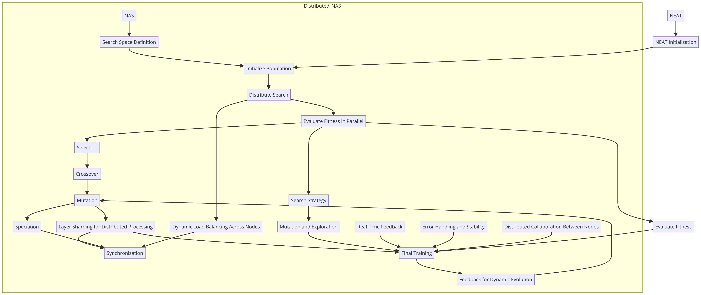

# DENSE: Distributed Evolutionary Network Search Engine

DENSE (Distributed Evolutionary Network Search Engine) is a Golang-based neural network library designed for flexibility and scalability. It combines elements of NEAT (NeuroEvolution of Augmenting Topologies), NAS (Neural Architecture Search), and Distributed NAS to create a powerful platform for neural network experimentation and development. The system is capable of running both natively and as WebAssembly, making it suitable for various environments, including the web.


## Architectural Overview

The architecture of DENSE was developed through a careful process of evaluating various programming languages and technologies, with the goal of achieving a balance between performance, ease of use, and compatibility with modern web technologies. Below is a detailed explanation of how the architecture was shaped.


1. **Initial Considerations**: Python, JavaScript, Ruby, Java, and C# were considered but ultimately ruled out due to performance or complexity concerns. GoLang, combined with WebAssembly, emerged as the optimal choice for high performance and compatibility across platforms.
   
2. **Final Selection**: GoLang and WebAssembly provide the right balance of simplicity, concurrency support, and performance, enabling both server-side and in-browser execution of neural network operations.

## New Diagram: Sharding and Future End-Goal

To optimize processing time and scalability, DENSE incorporates **Layer Sharding**, a technique that splits network layers into shards for distributed processing. The updated architecture reflects the introduction of sharding into the mutation and training cycle, allowing networks to be evaluated and trained in parallel across multiple machines.



### Explanation of the New Diagram

- **Sharding**: Layer sharding enables the distribution of neural network layers across machines, allowing parallel processing. This reduces computational overhead and speeds up model evaluation and training.
- **Dynamic Evolution**: The system continuously evolves by using feedback from training to refine future network architectures.
- **Distributed Collaboration**: Different nodes collaborate in evaluating and refining models, sharing progress to optimize the overall search.
- **Real-Time Feedback**: Integrates real-time data during training, ensuring the model adapts dynamically to new inputs.

---

## Progress Overview

| Feature/Task                      | Description                                                                 | Status            | Completion % |
|------------------------------------|-----------------------------------------------------------------------------|-------------------|--------------|
| **Network Configuration**          | Define custom network architectures using layers and activation functions    | Completed         | 100%         |
| **Feedforward Propagation**        | Inputs are propagated through the network to produce outputs                 | Completed         | 100%         |
| **Random Initialization**          | Random generation of weights and biases for neurons and layers               | Completed         | 100%         |
| **Activation Functions**           | Implement different activation functions for neurons                        | Completed         | 100%         |
| - ReLU                             | Rectified Linear Unit Activation                                             | Completed         | 100%         |
| - Sigmoid                          | Sigmoid Activation Function                                                  | Completed         | 100%         |
| - Tanh                             | Hyperbolic Tangent Activation Function                                       | Completed         | 100%         |
| - Softmax                          | Softmax Activation for Multi-class Outputs                                   | Completed         | 100%         |
| - Leaky ReLU                       | Leaky ReLU Activation Function                                               | Completed         | 100%         |
| - Swish                            | Swish Activation Function                                                    | Completed         | 100%         |
| - ELU                              | Exponential Linear Unit                                                      | Completed         | 100%         |
| - SELU                             | Scaled Exponential Linear Unit                                               | Completed         | 100%         |
| - Softplus                         | Softplus Activation Function                                                 | Completed         | 100%         |
| **Node/Neuron Types**              | Implement different node types for diverse network behavior                  | Completed         | 100%         |
| - Input Nodes                      | Nodes that accept input data                                                 | Completed         | 100%         |
| - Hidden Nodes                     | Intermediate layers with learnable weights                                   | Completed         | 100%         |
| - Output Nodes                     | Nodes that output predictions from the network                               | Completed         | 100%         |
| **Hill Climbing Optimization**     | Simple mutation of weights, biases, and architecture to optimize performance | Completed         | 100%         |
| **Evaluate Network Error**         | Compute error by comparing actual vs expected outputs                        | Completed         | 100%         |
| **Persistence (Save/Load)**        | Serialize network configurations to JSON and load them back for inference    | Completed         | 100%         |
| **Visualization Tools**            | Graphical tools to visualize architecture, training progress, feature maps   | Planned           | 0%           |
| **Advanced Optimizers**            | Implement SGD, Adam, RMSprop optimizers                                      | Planned           | 0%           |
| **Custom Loss Functions**          | Implement MSE, Cross-Entropy Loss, Hinge Loss, etc.                          | Planned           | 0%           |
| **Regularization Techniques**      | Add L1, L2, dropout methods for preventing overfitting                       | Planned           | 0%           |
| **Convolutional/Recurrent Layers** | Support for CNNs and RNNs to handle image/sequence data                      | In Progress       | 20%          |
| **Backpropagation**                | Implement automatic differentiation for training deep networks               | Planned           | 0%           |
| **Batch Processing**               | Support mini-batch gradient descent for improved generalization and speed    | Planned           | 0%           |
| **Transfer Learning**              | Fine-tuning pre-trained models on new tasks                                  | Planned           | 0%           |
| **WebAssembly Enhancements**       | Optimize WebAssembly for better browser performance                          | In Progress       | 40%          |
| **WebGPU/WebGL Support**           | Use WebGPU/WebGL for faster model execution in the browser                   | Planned           | 0%           |
| **Distributed NAS**                | Implement parallel architecture search across multiple machines              | In Progress       | 60%          |
| **Integration with Other Tools**   | API integrations for exporting/importing models to/from other ML frameworks  | Planned           | 0%           |

---

## Current Features

- **Network Configuration**: 
  - Define custom network architectures with support for various activation functions.
  
- **Feedforward Propagation**: 
  - Propagate inputs through the network to produce outputs.

- **Random Initialization**: 
  - Generate random weights and biases for network layers and neurons.

- **Training**:
  - Simple hill climbing optimization through mutation of weights and biases.

- **Sharding**:
  - Split network layers into shards for distributed processing to reduce computation time.

- **Persistence**:
  - Serialize network configurations to JSON and load them back for further training or inference.

## Future Features

The following features are planned for future versions to enhance DENSE's capabilities and bring it closer to a comprehensive neural network framework:

- **Advanced Optimizers**: 
  - SGD, Adam, RMSprop, and other gradient-based optimizers.
  
- **Loss Functions**: 
  - Custom loss functions including MSE and Cross-Entropy.

- **Convolutional Layers**: 
  - Support for CNNs to handle image data.

- **Backpropagation**: 
  - Implement backpropagation with automatic differentiation.

- **Transfer Learning**: 
  - Allow fine-tuning of pre-trained models.

- **WebAssembly Enhancements**: 
  - Optimize WebAssembly output for faster model execution in the browser.

## Building and Running

To build the WebAssembly version of the neural network, use the following command:

```bash
GOOS=js GOARCH=wasm go build -o main.wasm main_wasm.go
