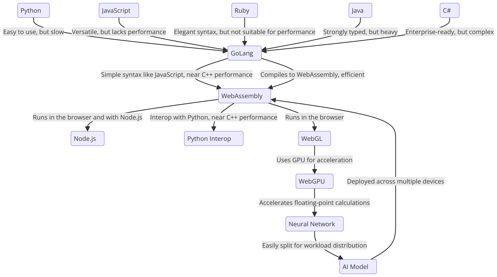

# CortexBuilder

CortexBuilder is a Golang-based neural network library designed for flexibility and scalability, capable of running both natively and as WebAssembly for use in web environments. This library focuses on providing a simple yet powerful platform for neural network experimentation and development.



## Architectural Overview

The architecture of CortexBuilder was developed through a careful process of evaluating various programming languages and technologies, with the goal of achieving a balance between performance, ease of use, and compatibility with modern web technologies. Below is a detailed explanation of how the architecture was shaped:

### Process of Elimination

1. **Initial Considerations**:
   - **Python**: Known for its simplicity and extensive machine learning libraries, Python was initially considered. However, its slower execution speed and the overhead associated with interpreted languages made it less suitable for high-performance neural network operations in a web environment.
   - **JavaScript**: Given its ubiquity in web development, JavaScript was another strong candidate. While it is versatile and runs natively in browsers, its performance limitations, particularly in computationally intensive tasks like neural networks, led to its exclusion.
   - **Ruby**: Ruby's elegant and human-readable syntax was appealing, but it quickly became evident that its performance characteristics did not align with the demands of neural network processing.
   - **Java**: Java's strong typing and robust ecosystem made it a potential candidate. However, its complexity and the heavier resource footprint were deemed unnecessary for the streamlined goals of this project.
   - **C#**: Although C# offers enterprise-level features and is powerful in its own right, its complexity, particularly in cross-platform scenarios, made it less desirable.

2. **Final Selection**:
   - **GoLang**: After eliminating the other languages, GoLang emerged as the optimal choice. Its simple syntax, combined with performance close to that of C++, made it an excellent candidate. GoLang’s native support for concurrency and its ability to compile into WebAssembly further reinforced this decision, making it ideal for neural network operations that need to run efficiently both on the server and in the browser.
   - **WebAssembly**: To leverage the power of GoLang in the web environment, WebAssembly was selected as the target compilation output. WebAssembly allows CortexBuilder to run with near-native performance in web browsers, ensuring broad compatibility and efficient execution. Additionally, its potential for integration with WebGPU provides a clear path forward for future enhancements that will accelerate neural network computations using the GPU.

### Current Features

- **Network Configuration**: 
  - Define custom network architectures using input, hidden, and output layers.
  - Support for various activation functions, including `ReLU`, `Sigmoid`, `Tanh`, `Softmax`, `Leaky ReLU`, `Swish`, `ELU`, `SELU`, and `Softplus`.

- **Network Operations**:
  - **Feedforward Propagation**: Propagate inputs through the network to produce outputs.
  - **Random Initialization**: Generate random weights and biases for network layers and neurons.
  - **Mutation and Optimization**: Implement random hill climbing with mutation of weights, biases, and network architecture to optimize performance.
  - **Error Evaluation**: Calculate the network's performance by comparing actual outputs against expected outputs using absolute error.

- **Training**:
  - **Random Hill Climbing**: A simple optimization algorithm that iteratively mutates the network to find improved configurations.

- **Persistence**:
  - **Save and Load Network Configurations**: Serialize network configurations to JSON and load them back for further training or inference.

## Future Features

The following features are planned for future versions to enhance CortexBuilder's capabilities and bring it closer to a comprehensive neural network framework:

- **Advanced Optimizers**:
  - Gradient-based optimizers like Stochastic Gradient Descent (SGD), Adam, and RMSprop.

- **Custom Loss Functions**:
  - Support for various loss functions, including Mean Squared Error (MSE), Cross-Entropy Loss, and Hinge Loss.
  
- **Regularization Techniques**:
  - Implement regularization methods like L1, L2, and dropout to prevent overfitting.

- **Convolutional and Recurrent Layers**:
  - Add support for Convolutional Neural Networks (CNNs) and Recurrent Neural Networks (RNNs) to handle image and sequence data.

- **Backpropagation**:
  - Implement backpropagation with automatic differentiation for efficient training of deep networks.

- **Batch Processing**:
  - Support for mini-batch gradient descent to speed up training and improve generalization.

- **Transfer Learning**:
  - Allow pre-trained models to be loaded and fine-tuned on new tasks.

- **Visualization Tools**:
  - Integrate tools to visualize network architecture, training progress, and feature maps.

- **WebAssembly Enhancements**:
  - Optimize the WebAssembly output for better performance in the browser.
  - Support for running trained models directly in the browser with WebGPU/WebGL acceleration.

- **Integration with Other Tools**:
  - Provide API integrations for exporting and importing models to/from other machine learning frameworks.
  - Support for interoperability with common data formats like CSV, JSON, and TFRecord.

## Building and Running

### /wasm
To build the WebAssembly version of the neural network, use the following command:

```bash
GOOS=js GOARCH=wasm go build -o main.wasm main_wasm.go
