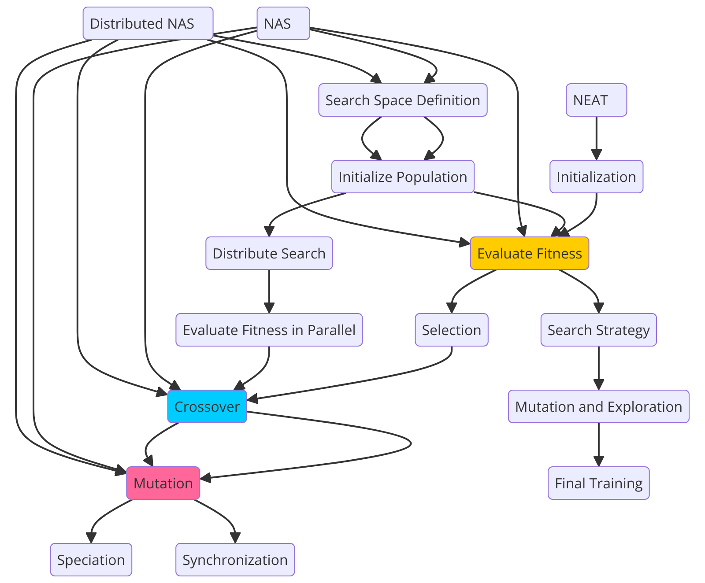

# DENSE: Distributed Evolutionary Network Search Engine

DENSE (Distributed Evolutionary Network Search Engine) is a Golang-based neural network library designed for flexibility and scalability. It combines elements of NEAT (NeuroEvolution of Augmenting Topologies), NAS (Neural Architecture Search), and Distributed NAS to create a powerful platform for neural network experimentation and development. The system is capable of running both natively and as WebAssembly, making it suitable for various environments, including the web.




## Architectural Overview

The architecture of DENSE was developed through a careful process of evaluating various programming languages and technologies, with the goal of achieving a balance between performance, ease of use, and compatibility with modern web technologies. Below is a detailed explanation of how the architecture was shaped


## Progress Overview

| Feature/Task                      | Description                                                                 | Status            | Completion % |
|------------------------------------|-----------------------------------------------------------------------------|-------------------|--------------|
| **Network Configuration**          | Define custom network architectures using layers and activation functions    | Completed         | 100%         |
| **Feedforward Propagation**        | Inputs are propagated through the network to produce outputs                 | Completed         | 100%         |
| **Random Initialization**          | Random generation of weights and biases for neurons and layers               | Completed         | 100%         |
| **Activation Functions**           | Implement different activation functions for neurons                        | Completed         | 100%         |
| - ReLU                             | Rectified Linear Unit Activation                                             | Completed         | 100%         |
| - Sigmoid                          | Sigmoid Activation Function                                                  | Completed         | 100%         |
| - Tanh                             | Hyperbolic Tangent Activation Function                                       | Completed         | 100%         |
| - Softmax                          | Softmax Activation for Multi-class Outputs                                   | Completed         | 100%         |
| - Leaky ReLU                       | Leaky ReLU Activation Function                                               | Completed         | 100%         |
| - Swish                            | Swish Activation Function                                                    | Completed         | 100%         |
| - ELU                              | Exponential Linear Unit                                                      | Completed         | 100%         |
| - SELU                             | Scaled Exponential Linear Unit                                               | Completed         | 100%         |
| - Softplus                         | Softplus Activation Function                                                 | Completed         | 100%         |
| **Node/Neuron Types**              | Implement different node types for diverse network behavior                  | Completed         | 100%         |
| - Input Nodes                      | Nodes that accept input data                                                 | Completed         | 100%         |
| - Hidden Nodes                     | Intermediate layers with learnable weights                                   | Completed         | 100%         |
| - Output Nodes                     | Nodes that output predictions from the network                               | Completed         | 100%         |
| **Hill Climbing Optimization**     | Simple mutation of weights, biases, and architecture to optimize performance | Completed         | 100%         |
| **Evaluate Network Error**         | Compute error by comparing actual vs expected outputs                        | Completed         | 100%         |
| **Persistence (Save/Load)**        | Serialize network configurations to JSON and load them back for inference    | Completed         | 100%         |
| **Visualization Tools**            | Graphical tools to visualize architecture, training progress, feature maps   | Planned           | 0%           |
| **Advanced Optimizers**            | Implement SGD, Adam, RMSprop optimizers                                      | Planned           | 0%           |
| **Custom Loss Functions**          | Implement MSE, Cross-Entropy Loss, Hinge Loss, etc.                          | Planned           | 0%           |
| **Regularization Techniques**      | Add L1, L2, dropout methods for preventing overfitting                       | Planned           | 0%           |
| **Convolutional/Recurrent Layers** | Support for CNNs and RNNs to handle image/sequence data                      | In Progress       | 20%          |
| **Backpropagation**                | Implement automatic differentiation for training deep networks               | Planned           | 0%           |
| **Batch Processing**               | Support mini-batch gradient descent for improved generalization and speed    | Planned           | 0%           |
| **Transfer Learning**              | Fine-tuning pre-trained models on new tasks                                  | Planned           | 0%           |
| **WebAssembly Enhancements**       | Optimize WebAssembly for better browser performance                          | In Progress       | 40%          |
| **WebGPU/WebGL Support**           | Use WebGPU/WebGL for faster model execution in the browser                   | Planned           | 0%           |
| **Distributed NAS**                | Implement parallel architecture search across multiple machines              | In Progress       | 60%          |
| **Integration with Other Tools**   | API integrations for exporting/importing models to/from other ML frameworks  | Planned           | 0%           |


# DENSE Diagram Elements Progress

| Element                      | Description                                                                                          | Category                | Completion % |
|-------------------------------|------------------------------------------------------------------------------------------------------|-------------------------|--------------|
| **Distributed NAS**            | Distributed Neural Architecture Search, allowing parallel processing across multiple machines         | System Component        | 0%           |
| **NAS**                        | Neural Architecture Search focused on finding optimal deep learning architectures                    | System Component        | 0%           |
| **NEAT**                       | NeuroEvolution of Augmenting Topologies, evolving both network structure and weights                   | System Component        | 0%           |
| **Search Space Definition**     | Defines the architecture search space, including layer types, nodes, and hyperparameters               | Search Process          | 0%           |
| **Initialize Population**       | Initializes a population of architectures or networks from the defined search space                    | Search Process          | 0%           |
| **Evaluate Fitness**            | Tests each network or architecture to assign a fitness score based on task performance                 | Evaluation Step         | 0%           |
| **Distribute Search**           | Assigns architecture evaluations to different machines or computational nodes                         | Distributed Processing  | 0%           |
| **Evaluate Fitness in Parallel**| Evaluates the fitness of architectures in parallel across distributed machines                         | Distributed Processing  | 0%           |
| **Selection**                   | Selects the top-performing architectures or networks for the next generation                          | Selection Process       | 0%           |
| **Search Strategy**             | Strategy used for exploration of the architecture space (e.g., reinforcement learning, evolution)     | Search Process          | 0%           |
| **Mutation and Exploration**    | Introduces variations in architectures by mutating hyperparameters, layers, or nodes                   | Exploration Step        | 0%           |
| **Crossover**                   | Combines the structure and weights of selected architectures to create new candidates                  | Genetic Algorithm Step  | 0%           |
| **Mutation**                    | Introduces random changes in the structure, connections, or weights of architectures                   | Genetic Algorithm Step  | 0%           |
| **Speciation**                  | Groups similar architectures into species to protect innovation and encourage diversity               | Evolutionary Step       | 0%           |
| **Synchronization**             | Synchronizes the search results across machines or nodes after parallel evaluations                   | Distributed Processing  | 0%           |
| **Final Training**              | Fully trains the selected architecture once the optimal one is found                                  | Training Step           | 0%           |
| **Initialization**              | Starts with simple networks in the NEAT approach and progressively evolves more complex networks      | Evolutionary Step       | 0%           |

---

### Explanation:

- **System Components**: High-level elements like NAS, NEAT, and Distributed NAS that represent the overall system design and process.
- **Search Process**: Steps related to initializing the architecture population, defining the search space, and exploring it.
- **Evaluation Step**: Processes that evaluate and assign fitness scores to different architectures or networks.
- **Distributed Processing**: Elements related to parallel evaluation and processing across multiple machines or nodes.
- **Selection Process**: Steps involving choosing the best architectures for further exploration.
- **Genetic Algorithm Step**: Processes like crossover and mutation that generate new architectures using genetic algorithms.
- **Evolutionary Step**: Involves speciation, mutation, and progressively evolving networks in NEAT.
- **Training Step**: Final step where the best architecture is fully trained.

---

### Current Progress: 0%

This table outlines all the key elements that need to be worked on, but no implementation has started yet. This is a full roadmap for the tasks required in building out the **DENSE** system.


### Process of Elimination


1. **Initial Considerations**:
   - **Python**: Known for its simplicity and extensive machine learning libraries, Python was initially considered. However, its slower execution speed and the overhead associated with interpreted languages made it less suitable for high-performance neural network operations in a web environment.
   - **JavaScript**: Given its ubiquity in web development, JavaScript was another strong candidate. While it is versatile and runs natively in browsers, its performance limitations, particularly in computationally intensive tasks like neural networks, led to its exclusion.
   - **Ruby**: Ruby's elegant and human-readable syntax was appealing, but it quickly became evident that its performance characteristics did not align with the demands of neural network processing.
   - **Java**: Java's strong typing and robust ecosystem made it a potential candidate. However, its complexity and the heavier resource footprint were deemed unnecessary for the streamlined goals of this project.
   - **C#**: Although C# offers enterprise-level features and is powerful in its own right, its complexity, particularly in cross-platform scenarios, made it less desirable.

2. **Final Selection**:
   - **GoLang**: After eliminating the other languages, GoLang emerged as the optimal choice. Its simple syntax, combined with performance close to that of C++, made it an excellent candidate. GoLang’s native support for concurrency and its ability to compile into WebAssembly further reinforced this decision, making it ideal for neural network operations that need to run efficiently both on the server and in the browser.
   - **WebAssembly**: To leverage the power of GoLang in the web environment, WebAssembly was selected as the target compilation output. WebAssembly allows DENSE to run with near-native performance in web browsers, ensuring broad compatibility and efficient execution. Additionally, its potential for integration with WebGPU provides a clear path forward for future enhancements that will accelerate neural network computations using the GPU.

### Current Features

- **Network Configuration**: 
  - Define custom network architectures using input, hidden, and output layers.
  - Support for various activation functions, including `ReLU`, `Sigmoid`, `Tanh`, `Softmax`, `Leaky ReLU`, `Swish`, `ELU`, `SELU`, and `Softplus`.

- **Network Operations**:
  - **Feedforward Propagation**: Propagate inputs through the network to produce outputs.
  - **Random Initialization**: Generate random weights and biases for network layers and neurons.
  - **Mutation and Optimization**: Implement random hill climbing with mutation of weights, biases, and network architecture to optimize performance.
  - **Error Evaluation**: Calculate the network's performance by comparing actual outputs against expected outputs using absolute error.

- **Training**:
  - **Random Hill Climbing**: A simple optimization algorithm that iteratively mutates the network to find improved configurations.

- **Persistence**:
  - **Save and Load Network Configurations**: Serialize network configurations to JSON and load them back for further training or inference.

## Future Features

The following features are planned for future versions to enhance DENSE's capabilities and bring it closer to a comprehensive neural network framework:

- **Advanced Optimizers**:
  - Gradient-based optimizers like Stochastic Gradient Descent (SGD), Adam, and RMSprop.

- **Custom Loss Functions**:
  - Support for various loss functions, including Mean Squared Error (MSE), Cross-Entropy Loss, and Hinge Loss.
  
- **Regularization Techniques**:
  - Implement regularization methods like L1, L2, and dropout to prevent overfitting.

- **Convolutional and Recurrent Layers**:
  - Add support for Convolutional Neural Networks (CNNs) and Recurrent Neural Networks (RNNs) to handle image and sequence data.

- **Backpropagation**:
  - Implement backpropagation with automatic differentiation for efficient training of deep networks.

- **Batch Processing**:
  - Support for mini-batch gradient descent to speed up training and improve generalization.

- **Transfer Learning**:
  - Allow pre-trained models to be loaded and fine-tuned on new tasks.

- **Visualization Tools**:
  - Integrate tools to visualize network architecture, training progress, and feature maps.

- **WebAssembly Enhancements**:
  - Optimize the WebAssembly output for better performance in the browser.
  - Support for running trained models directly in the browser with WebGPU/WebGL acceleration.

- **Integration with Other Tools**:
  - Provide API integrations for exporting and importing models to/from other machine learning frameworks.
  - Support for interoperability with common data formats like CSV, JSON, and TFRecord.

## Building and Running

### /wasm
To build the WebAssembly version of the neural network, use the following command:

```bash
GOOS=js GOARCH=wasm go build -o main.wasm main_wasm.go
