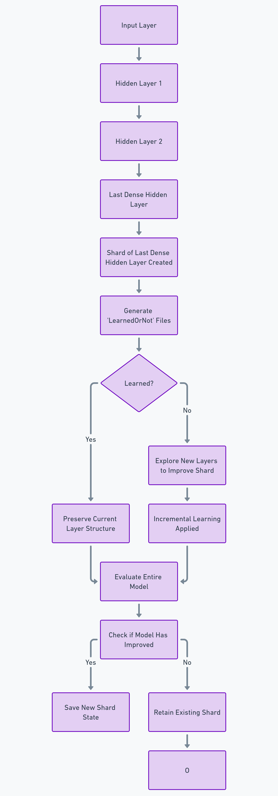

# DENSE (Distributed Evolutionary Network Search Engine)

This section explains the **single-machine approach** for DENSE before rebuilding the functionality for distributed computing. The single-machine setup focuses on creating a baseline model and optimizing it generation by generation, while laying the groundwork for future distribution across multiple devices.

---

## Core Innovation: Layerwise Sharded Progressive Architecture Search (LSPAS)

DENSE implements a novel approach called Layerwise Sharded Progressive Architecture Search (LSPAS), which combines:
- Progressive layer-wise exploration
- Sharded evaluation
- Targeted architecture mutation
- Distributed computation capabilities

This method enables efficient neural architecture search by:
1. Breaking down network evaluation into manageable shards
2. Preserving and testing specific layer states
3. Making targeted architectural improvements
4. Validating changes before full network integration

---

## Process Overview

For every generation, DENSE will:

1. **Create a Shard of the Last Dense Hidden Layer**:  
   At each generation, DENSE saves a shard representing the latest dense hidden layer. This snapshot captures the evaluation point in time, reducing computational costs and providing a starting point for future distributed processing.

2. **Generate 'LearnedOrNot' Files**:  
   These files track which evaluation shards have already been learned and which ones remain to be explored. This helps the system incrementally focus on learning new information without retraining the entire model. By analyzing the 'LearnedOrNot' files, the system identifies which layers need further exploration and refinement.

3. **Layer Sharding with Incremental Learning**:  
   DENSE uses LSPAS to implement "Layer Sharding with Incremental Learning." In each iteration, it:
   - Loads specific evaluation shards
   - Explores potential architectural improvements
   - Tests changes on relevant data segments
   - Validates improvements before integration
   This allows the model to evolve by improving specific layers while retaining the rest of the network's learned structure.

4. **Shard-to-Shard Linking and Model Distribution** (Future Step):  
   Once the model has been optimized on a single machine, the next phase will involve linking the shards together, enabling them to be distributed across multiple devices. LSPAS's sharded approach naturally facilitates this distribution by:
   - Maintaining independent layer states
   - Enabling parallel architecture exploration
   - Supporting distributed validation
   - Facilitating efficient resource utilization

---

## Technical Implementation

The LSPAS approach is implemented through several key mechanisms:

1. **State Preservation**:
   ```go
   FeedforwardLayerStateSavingShard(config *NetworkConfig, inputValues map[string]interface{}, hiddenLayer int, modelFilePath string)
   ```
   Saves and manages intermediate layer states for targeted exploration.

2. **Targeted Mutation**:
   ```go
   ApplyMutations(modelFilePathFolder string, inputIDNumber int, layerNum int, savedLayerData interface{}, modelDir string)
   ```
   Tests architectural variations on specific network sections.

3. **Progressive Integration**:
   - Validates improvements on individual shards
   - Tests overall network performance
   - Maintains model stability during evolution

---

## Approach Summary

DENSE combines Layer Sharding with Incremental Learning through the LSPAS methodology. This approach:
- Optimizes the model layer by layer
- Preserves computational resources through intelligent sharding
- Enables future distributed processing
- Maintains network stability during evolution
- Supports targeted architectural improvements

By exploring how layers can be added and refined without losing the structure of the model, DENSE aims to continually improve the network over generations while minimizing redundant computations and setting the foundation for distributed neural architecture search.

